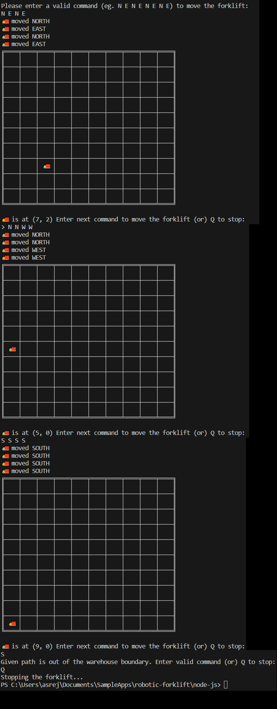
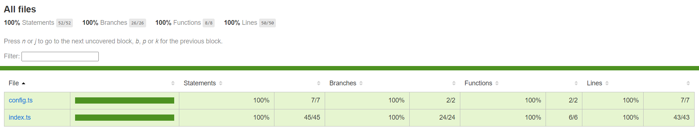
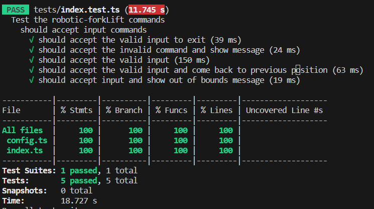

# robotic-forklift
Robotic Forklift moving about in a warehouse

The challenge:
=============
We have installed a robot in our warehouse and now we need to be able to send commands to control it. We need you to implement the primary control mechanism.

For convenience the robot moves along a grid in the roof of the warehouse and we've made sure that all of our warehouses are built so that the dimensions of the grid are 10 by 10. We've also made sure that all our warehouses are aligned along north-south and east-west axes.

All of the commands to the robot consist of a single capital letter and different commands are delineated by whitespace.

#### Requirements

* Create a way to send a series of commands to the robot
* Make sure the robot doesn't try to break free and move outside the boundary of the warehouse

The robot should accept the following commands:

* N move north
* W move west
* E move east
* S move south

#### Example command sequences

The command sequence: "N E S W" will move the robot in a full square, returning it to where it started.

If the robot starts in the south-west corner of the warehouse then the following commands will move it to the middle of the warehouse.

"N E N E N E N E"

#### Tips & Recommendations

- Make sure you apply your best coding style & design your implementation as as if your code was going into production
- If you can, show us your best application code design and engineering practices
- Write some tests. We practice TDD at Lyka and you'll need to demonstrate your best testing capabilities.
- Don't forget to tell us how to run your code. If we can't run it, we can't assess whether it works or not.
- And do make sure it works. If we can't run the code and see your robot in action we won't be able to get you through to the next round

STEPS FOLLOWED IN DEVELOPMENT
=============================

1. Initialised a blank nodejs project:  [npm init -y]
2. Initialised the project to use typescript and jest: [npm install jest supertest ts-node ts-jest @types/jest @types/node]
3. Created index.ts with a simple console.log message
3. Created a test file to test the warehouse roof mapping
4. Implemented the warehouse roof map as an Array to get the test to pass
5. Updated the test to check the movement of the forklift(x,y co-ordinates in the array) by brute force method
6. Implemented the movement based on inputs
7. Updated the test to cover boundaries
8. Implemented the boundaries check
9. Updated the test to validate the input commands
10. Implement the script to include validation of the input commands

11. Implement the script to accept continuous commands to keep the forklift moving
12. Updated the test to expect continuous command and modified the tests accordingly to reflect the forklift positions

TO OPERATE THE FORKLIFT
=======================

1. Clone the repo
2. npm install
3. npm run start
4. npm run test - to run the tests

As stated in the requirment, the valid inputs are space(' ') separated directional instructions (eg. N E N E S W)
The application expects inputs from the user to move the lift along the warehouse roof.

Screen shots:
============

Test Results:

